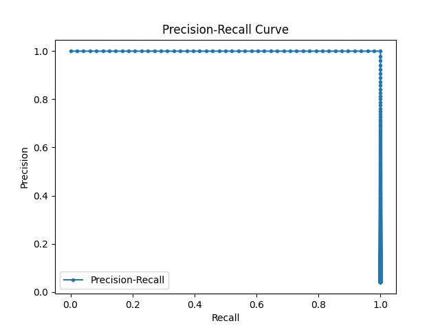

# IU X-Ray Multimodal Classification

This project uses **images (X-ray/MRI)** and **radiology report text** to predict a target class (e.g., pneumonia vs. no pneumonia). The workflow involves:
1. Generating CSV files (train.csv, test.csv) from an `annotation.json` that contains image paths and report text.
2. Building a custom PyTorch `Dataset` (`IUXrayDataset`) to load images and tokenize text.
3. Training a **multimodal model** (`MultiModalClassifier`) that combines:
	- A **pretrained ResNet** (CNN) for image feature extraction
	- An **Embedding + LSTM** for text feature extraction
	- A **feed-forward MLP** to fuse these embeddings and predict the final label
4. Saving the trained model weights, then testing/evaluating on the test split.
 
---  

## Architecture diagram


## Results




[Evaluation report](results/evaluation_results.txt)


<!-- ## FLow chart

 -->

---

## Project Structure

```
iu_xray/
    ├── annotation.json 
    ├── train.csv 
    ├── test.csv 
    ├── dataset.py
    ├── train.py # Training script (loads train.csv, trains model, saves model + vocab)
    ├── test.py # Testing script (loads test.csv, vocab.pkl, and trained_model.pth)
    ├── multimodal.py # MultiModalClassifier definition (CNN + LSTM + MLP)
    └── vocab.pkl # Saved vocabulary from training

```
---
## Requirements
- Python 3.7+
- PyTorch (e.g., `pip install torch torchvision`)
- pandas (for CSV reading/riting)

Example `requirements.txt` snippet:
```
torch==2.0.0
torchvision=0.15.1
pandas==1.5.3
scikit-learn==1.2.2
```
---

## Setup & Usage
### 1. Generate Train/Test CSVs

If your `annotation.json` already contains separate `"train"` and `"test"` entries, you can create **train.csv** and **test.csv**. For example, in `main.py`:  
```bash
python main.py
```
This script will:
- Read `annotation.json`
- Extract each entry’s image path, report text, split
- Write out `train.csv` and `test.csv`

**Output**:
```
train.csv created with X samples
test.csv created with Y samples
```

### 2. Train the Model

Run:
```bash

python  train.py

```
What happens:

-  `train.py` reads **train.csv** via the `IUXrayDataset`.

- It builds a vocabulary from all text, saves it to `vocab.pkl`.

- Instantiates the `MultiModalClassifier` (from `multimodal.py`).

- Trains for a specified number of epochs (default is 5).

- Saves the final model weights as `trained_model.pth`.

**Output** example:

```
Vocabulary saved to vocab.pkl
Epoch [1/5], Loss: 0.4893
...
Model saved to trained_model.pth
```

### 3. Test the Model

Run:
```bash

python  test.py

```

What happens:

-  `test.py` loads **test.csv** with the same `IUXrayDataset`.

-  **Loads** the saved `vocab.pkl` to ensure the same word-to-index mapping.

-  **Instantiates** the model with `vocab_size` matching training.

-  **Loads** the saved weights from `trained_model.pth`.

-  **Runs inference** on the test set and prints metrics (e.g., accuracy).

  

**Output** example:

```
Test Accuracy: 0.9992
```


### 4. Evaluate the model metrics
* Generates confusion matrics, precision recall curve and evaluation results in results folder

```
python evaluate.py
```

Output:
```
Vocabulary loaded successfully.
Accuracy: 0.9983
Precision: 0.9600
Recall: 1.0000
F1 Score: 0.9796

Classification Report:
               precision    recall  f1-score   support

         0.0       1.00      1.00      1.00      1132
         1.0       0.96      1.00      0.98        48

    accuracy                           1.00      1180
   macro avg       0.98      1.00      0.99      1180
weighted avg       1.00      1.00      1.00      1180
```
---
  
## Model Architecture

1.  **Image Branch**: Pretrained ResNet-18 with final FC layer removed → outputs a 512-dim feature vector.

2.  **Text Branch**: Embedding + LSTM → outputs a 128-dim feature vector (default).

3.  **Fusion**: Concatenate (512 + 128 = 640 dims).

4.  **MLP**: A linear layer reduces 640 → 128, ReLU, then a final linear layer outputs 1 logit for binary classification.


**Loss Function**: `BCEWithLogitsLoss` for binary classification (pneumonia vs. no pneumonia, for example).

--- 

## Potential Improvements
  
1.  Applying more transformations to the training images (e.g., rotation, flipping, contrast adjustment) to help generalization.
    
2.  Using a deeper CNN, transformer-based text encoders, or attention mechanisms.
    
3.  Instead of LSTM, we could try transformers like BERT for text processing.
    
4.  Instead of using a fixed ResNet feature extractor, fine-tuning the CNN layers on the dataset might improve performance.
 
---
 
## Acknowledgments
  
- [IU X-Ray Dataset](https://openi.nlm.nih.gov/faq)

- [PyTorch](https://pytorch.org/)

- [Torchvision Models](https://pytorch.org/vision/stable/models.html)
